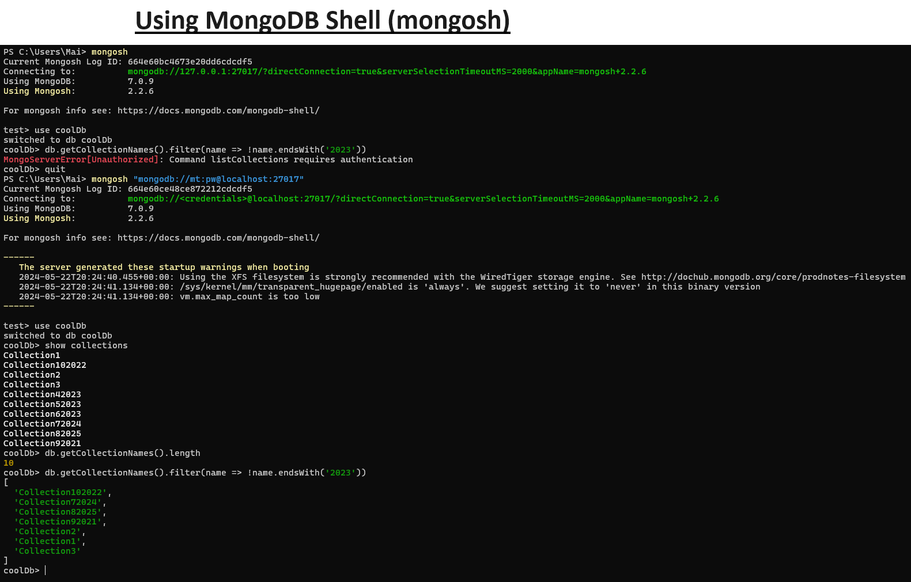

# mongodb-playground

### Install and Start A MongoDB Server
#### via Local Environment
1) Download MongoDB from official website: https://www.mongodb.com/try/download/community
2) On command line, start it by running `$ mongod`
3) Will start on default port 27017, but can specify different port using `$ mongod --port 27017`
4) Connect to it with Mongosh shell using commands below!

#### via Docker
1) Download Docker from official website: https://docs.docker.com/get-started/get-docker/
2) Pull the MongoDb docker image from Docker Hub by running `$ docker pull mongo`
    * The official image link: https://hub.docker.com/_/mongo
3) Start the MongoDb container with `$ docker run -d -p 27017:27017 -e MONGO_INITDB_ROOT_USERNAME=mt -e MONGO_INITDB_ROOT_PASSWORD=pw mongo`
    * `-d` runs the container in detached mode (in the background)
    * `-p 27017:27017` maps the container's MongoDB port (27017) to your local machine's port 27017
    * `-e MONGO_INITDB_ROOT_USERNAME=mt` sets the username
    * `-e MONGO_INITDB_ROOT_PASSWORD=pw` sets the password
    * `mongo` is the official MongoDB image
4) Confirm the container is successfully running with `$ docker ps`
5) Connect to it with Mongosh shell using commands below.
6) Stop the container with `$ docker stop <ID of container>`

### Log Into Mongo DB Via Mongosh Shell

`$ mongosh "mongodb://localhost:27017" --username mt --password pw`

OR

`$ mongosh "mongodb://mt@pw:localhost:27017/coolDb"`

** Need to make sure that mt is authorized on coolDb database first! by executing `$ db.getUser("mt")`on the specific database.

Docs: https://www.mongodb.com/docs/mongodb-shell/

### Common mongosh Commands

```
$ show dbs

$ use <database_name>

$ show collections

$ db.<collection>.find()

$ db.<collection>.countDocuments()

$ use newDatabase
NOTE: `$ use newDatabase` will create a new database. If it does not exist, a new one will be created!
Then to make sure db is created, insert at least one document into a collection within the db. MongoDB is schema-less and can store any data structures or format.

$ db.newCollection.insertOne({ name: "Bob", age: 37})

$ db.newCollection.insertMany([
  { name: "Alice", age: 30 },
  { name: "Bob", hobbies: ["reading", "hiking"] },
  { name: "Charlie", address: { city: "New York", zip: "10001" } }
])

$ db.newCollection.find()
NOTE: To show all document within a collection.

$ db.newCollection.find({ name: "Bob"}).pretty()
NOTE: To find a document with specific field and value. Can find using regex too or with multiple fields.

$ db.grantRolesToUser("mt", [{ role: "readWrite", db: "customerdb" }])
NOTE: Need to grant permission to new database! Or create new user! There is a default credential but it will not apply to new databases created. Hence, you might run into authorization issues in your app or on command line!

$ db.createUser({ user: "mt", pwd: "pw", roles: [{ role: "readWrite", db: "customerdb" }] })
```

#### Mongosh Usage

